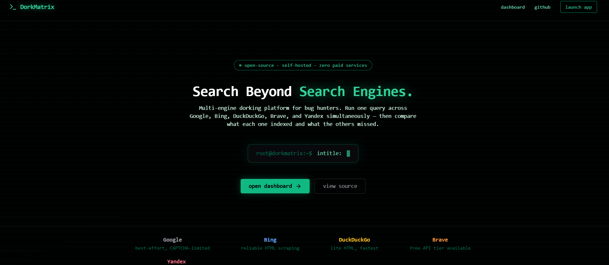
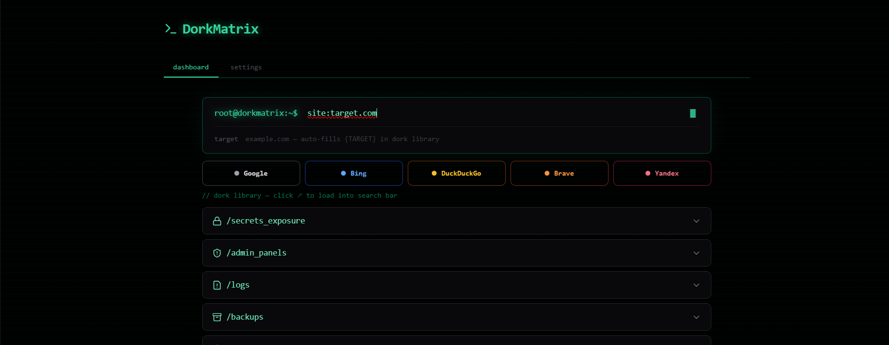

# DorkMatrix

> **Search Beyond Search Engines.**

DorkMatrix is a fully open-source, self-hosted recon platform for bug hunters.
Type a Google Dork query and instantly open it across Google, Bing, DuckDuckGo,
Brave, and Yandex — each in its own browser tab, fully pre-filled.

No paid APIs. No proxies. No SaaS. Runs entirely on your machine.

🔗 **Source:** https://github.com/showrya01/Projects/tree/main/DorkMatrix/

---

## What It Does

Sensitive files, admin panels, logs, and exposed endpoints sometimes appear
in one search engine but not others. DorkMatrix lets you fire the same dork
across all five engines in one click — so you never miss what one engine
indexed and another didn't.

Because DorkMatrix opens the real search engine in your browser tab, there
is no bot detection to worry about. You are the browser. The engine sees
a normal user visit every time.

---
## How it looks 
|HOME|
|--------------|

|DASHBOARD|



Check installed versions:
```bash
node -v
npm -v
```

---

## Installation

### Step 1 — Get the code

## Download  Package

Using wget:

```bash
wget https://raw.githubusercontent.com/showrya01/Projects/main/DorkMatrix/DorkMatrix.tar.gz
mkdir dorkmatrix && cd dorkmatrix
tar -xzf DorkMatrix.tar.gz

```

Using curl:

```bash
curl -L -O https://raw.githubusercontent.com/showrya01/Projects/main/DorkMatrix/DorkMatrix.tar.gz
mkdir dorkmatrix && cd dorkmatrix
tar -xzf DorkMatrix.tar.gz

```


### Step 2 — Install dependencies 

``` bash
npm install
```

You will see deprecation warnings from Next.js sub-dependencies.
These are safe to ignore. Install is complete when there are no `npm error` lines.

---

### Step 3 — Fix jsconfig (required)

```bash
cat > jsconfig.json << 'JSEOF'
{
  "compilerOptions": {
    "baseUrl": "src",
    "paths": {
      "@/*": ["./*"]
    }
  }
}
JSEOF
```

---

### Step 4 — Start the dev server

```bash
npm run dev
```

Expected output:
```
▲ Next.js 14.2.3
- Local: http://localhost:3000
✓ Ready in ~2s
```
If you see 
```

 ⚠ Port 3000 is in use, trying 3001 instead.
  ▲ Next.js 14.2.3
  - Local:        http://localhost:3001
 ○ Compiling /_not-found ...
 ✓ Compiled /_not-found in 3.3s (431 modules)
 GET / 404 in 3485ms
 GET / 404 in 46ms
```
Then use this to eliminate the error : 
```
rm -rf app components lib DorkMatrix.tar.gz

```
Open: **http://localhost:3000**

---
## Project Structure

```
DorkMatrix/
├── src/
│   ├── app/
│   │   ├── layout.js              # Root layout
│   │   ├── globals.css            # Global styles + Tailwind directives
│   │   ├── page.js                # Landing page        →  /
│   │   ├── search/
│   │   │   └── page.js            # Dashboard           →  /search
│   │   └── settings/
│   │       └── page.js            # Settings            →  /settings
│   ├── components/
│   │   └── shared/
│   │       └── Nav.jsx            # Shared navigation bar
│   |── data/
│      └── mockData.js            # Dork library + engine metadata    
├── package.json
├── next.config.js
├── tailwind.config.js
├── postcss.config.js
├── jsconfig.json
└── README.md
```

---

## Tech Stack

| Technology | Version | Purpose |
|-----------|---------|---------|
| Next.js | 14.2.3 | React framework, App Router |
| React | 18 | UI components |
| TailwindCSS | 3.4 | Styling |
| lucide-react | 0.383 | Icons |
| framer-motion | 11 | Animations |

---

## Requirements

| Tool | Minimum Version |
|------|----------------|
| Node.js | 18.x |
| npm | 9.x |
## How to Use

### 1. Open the dashboard

Go to **http://localhost:3000/search**

---

### 2. Type your dork

```
site:example.com ext:env
```

---

### 3. Set a target (optional)

Enter a domain in the **target** field.
It auto-fills `{TARGET}` in every dork in the library below.

```
Target: example.com
Dork:   site:{TARGET} ext:env  →  site:example.com ext:env
```

## Settings Page

Navigate to **/settings** to configure:

| Setting | Description |
|---------|-------------|
| API Keys | Google, Bing, Brave (all optional) |
| Default Engines | Which engines are active |

---

## Troubleshooting

### 404 on localhost:3000

Duplicate `app/` folder at root level — Next.js picks it over `src/app/`.

```bash
ls ~/Projects/DorkMatrix/frontend/
```

If you see `app/` alongside `src/`, delete it:

```bash
rm -rf app/ components/ lib/
rm -rf .next/
npm run dev
```

---

### npm install fails on Windows/WSL (EPERM / UNC path error)

You are running Windows npm inside WSL. Install Node.js natively inside WSL:

```bash
rm -rf app components lib DorkMatrix.tar.gz 
curl -o- https://raw.githubusercontent.com/nvm-sh/nvm/v0.39.7/install.sh | bash
source ~/.bashrc
nvm install 18
nvm use 18
cd ~/Projects/DorkMatrix/
rm -rf node_modules
npm install
npm run dev
```

---

### Popup blocked when clicking engine buttons

Browser is blocking new tabs from localhost.

- **Chrome / Brave** → Click the blocked popup icon in the address bar → Always allow
- **Firefox** → Click the shield icon → Allow popups from localhost

---

### Page loads but looks unstyled

TailwindCSS failed to compile. Clear and restart:

```bash
rm -rf .next node_modules/.cache
npm run dev
```

---

### Port 3000 already in use

```bash
kill $(lsof -t -i:3000)
npm run dev
```

---

## Build for Production

```bash
npm run build
npm start
```

---

## Version

**v1.0** — Frontend only release.

This version redirects queries directly to real search engines in the browser.
No scraping, no backend required for core search functionality.

Future versions will include:
- Backend scraping with result aggregation
- Cross-engine URL comparison
- Export to JSON / PDF
- Search history

---

## Legal & Responsible Use

DorkMatrix is built for authorized security research, bug bounty hunting,
and penetration testing.

**Only use it against:**
- Infrastructure you own
- Intentionally vulnerable practice labs (e.g. `testphp.vulnweb.com`)
- Bug bounty targets within their defined scope

Unauthorized testing of systems you do not own or have explicit written
permission to assess may violate the Computer Fraud and Abuse Act (CFAA)
and equivalent laws in your jurisdiction.

The authors are not responsible for misuse.

---

## License

MIT — free to use, modify, and distribute.

---

*Built for bug hunters. Use responsibly.*
